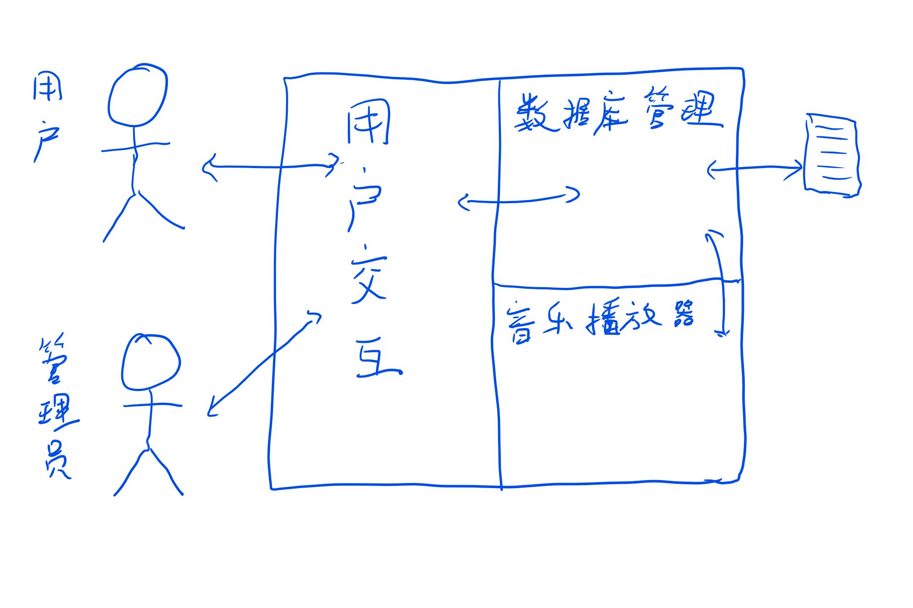

# KTV点歌管理系统 开发手册
#### Author nyaachen
#### All Right Preserved

## 目录

1. 点歌系统整体介绍
2. 点歌系统功能分析与抽象
3. 点歌系统模块设计与分析
4. 点歌系统关键算法
5. 点歌系统原型实现
~~6. 实现的完善与功能的细化~~
~~7. 最终实现~~

## 点歌系统整体介绍

本次试验要求完成一个KTV点歌管理系统，实现对用户和管理员的两个用户角色的服务。

启动点歌系统，进入登录界面， 提供对用户和管理员的登录接口。管理员登陆需要口令验证，用户可以直接登录。  
管理员登陆后可以查看系统中所有歌曲的信息，对歌曲进行添加、删除、重排序，也可以修改自己的登录密码。  
用户界面可以查看所有歌曲、用不同方法点歌、查看已点歌曲、切歌，还可以为歌曲评分。  
以上为基本要求，可扩展更多功能。

## 点歌系统功能分析与抽象

容易发现，整个项目的核心就在于以合适的方式管理歌曲信息。因此作为项目的核心，数据库管理系统是必不可少的项目。整个系统就是不断的管理数据库并与用户进行交互。  
由于用户交互的复杂性和交互设备的多变性，用户交互界面通常与整个系统分离设计。  
考虑到项目的背景，我们额外增加了一个播放器系统，支持系统的扩展性，方便日后的功能拓展。

于是，整个点歌系统分为三大子系统：歌曲信息数据库管理子系统、音乐播放器子系统、用户交互子系统。  
在程序模块间逻辑上，用户交互系统直接与用户界面进行交互，同时将用户交互的结果通过统一的接口传递到数据库系统，而数据库系统将操作结果回传给用户交互系统。数据库系统根据需要，与播放器系统进行信息传递。

## 点歌系统模块设计与分析

在整个系统内，最重要的实体是歌曲，它具有多个属性，其中有一些是歌曲固有的，另一些是系统赋予的。

| 歌曲固有的属性 | 歌曲额外的属性 |
| :------------: | :------------: |
|     歌曲名     |   歌曲标识ID   |
|     歌手名     | 歌曲的播放状态 |
|    歌曲拼音    |  歌曲播放次数  |
|                |    ... ...     |

一首歌曲可以由它的三个固有属性唯一确定，额外属性是系统中的歌曲所独有的内部特征。因此，一个歌曲的抽象逻辑表示是一个多元组，而定义在其上的功能是访问、排序、检索。

| 歌曲的基本操作 |   输入描述   |        输出描述        |
| :------------: | :----------: | :--------------------: |
|    歌曲访问    | 访问固有属性 |       固有属性值       |
|   歌曲的检索   |     曲名     |        是否检索        |
|                |    歌手名    |        是否检索        |
|                |   歌曲拼音   |        是否检索        |
|    歌曲排序    |  另一首歌曲  |   按评分是否在歌曲前   |
|                |              |  按播放量是否在歌曲前  |
|                |              | 按歌曲编号是否在歌曲前 |
|                |              |   按拼音是否在歌曲前   |
|                |              |      ~~按歌曲名~~      |
|                |              |      ~~按歌手名~~      |

###### 注：按中文拼音顺进行排序没有实现。

---

数据表是数据库管理和保存的主要数据结构。作为一种成熟的数据抽象，数据表是一个广义表（二维度），但也可以理解为保存歌曲实体的线性表。其典型操作包括插入、删除、查找、排序、遍历等。

| 数据表的基本操作 |      输入描述       |    输出描述    |
| :--------------: | :-----------------: | :------------: |
|     歌曲检索     |   键值名、查找词    |  检索结果列表  |
|                  |      下标检索       |       -        |
|     歌曲插入     |      歌曲Song       | 插入是否成功TF |
|     歌曲删除     |          -          |       -        |
|     歌曲排序     | 排序依据的关键词key |  排序后的列表  |
|     歌曲遍历     |          -          |       -        |

---

数据库管理系统负责管理整个系统至关重要的数据管理功能。它维护着数据表和透视表，并对用户提供操作柄。每当操作柄对数据发生修改变化，数据库系统就将变化同步到文件中，防止潜在的数据丢失。

|  数据库管理系统的基本数据  |     基本操作     |      操作结果       |
| :------------------------: | :--------------: | :-----------------: |
| 歌曲数据总表、播放器透视表 |  获取用户操作柄  |  用户操作柄handler  |
|       各种临时透视表       | 获取管理员操作柄 | 管理员操作柄handler |
|       管理员密码数据       |    管理员登录    |          -          |
|                            |  管理员修改密码  |          -          |

---

操作柄是数据库管理系统对外接口的统一封装。用户应用程序通过操作柄操作数据库管理系统，可以有效避免用户程序对应用接口的滥用，保护系统数据。涉及数据库的读写时，用户通过操作柄通知数据库管理系统来将操作同步。

---

播放器系统应该拥有一张数据表来表示播放列表，但与真正的数据表不相同的是，它的抽象结构并不拥有数据。如果数据库发生了变化，那么播放列表也会发生相应的变化。也就是说，播放器维护的列表在数据结构角度更像是对数据库信息的引用，同时由于其动态的组成结构，更适合实现为链表。

|   播放器系统的基本操作   |     输入描述     | 输出描述 |
| :----------------------: | :--------------: | :------: |
| 播放下一首歌曲（即切歌） |        -         |    -     |
|    向播放列表添加歌曲    |     歌曲Song     |    -     |
|   调整播放列表歌曲顺序   | 要调整的歌曲位置 |    -     |

---

用户交互系统负责在指定的交互设备上实现与用户的交互，读取用户的输入，通过操作柄传递给数据库管理系统，并将操作柄返回的结果输出到交互设备。

**用户交互系统的标准字符终端交互实现**

| 用户交互系统的主要功能 | 输入描述 | 输出描述 |
| :--------------------: | :------: | :------: |
|      启动欢迎屏幕      |    -     |    -     |
|    管理员交互-登录     |    -     |    -     |
|    用户交互-主菜单     |    -     |    -     |
|        ... ...         |          |          |

## 点歌系统关键算法

难点在于对点歌系统搜索和排序功能的实现。传统的搜索返回的都是一个确定值，而这里的搜索和排序返回的都可能是多个值。受到标准库通用算法的启发，我选择设计谓词函数来解决检索与排序的问题。
另一个实现的难点在于命令行交互视图下的分页显示。初步的思路是，构建视图类，接受返回的列表，生成分页后的列表块，再进行显示。

## 点歌系统原型实现

Song类被实现为~~对标准库`std::map<SongAttrib>`类的派生~~具有足够保存所有数据的静态存储。所有的歌曲操作都有函数与之对应。
|  歌曲的基本操作  |          对应的函数实现          |
| :--------------: | :------------------------------: |
| 歌曲访问（具体） |   `title() artist() pinyin()`    |
|    歌曲的检索    |    `bool include_title(str)`     |
|                  |    `bool include_artist(str)`    |
|                  |    `bool include_pinyin(str)`    |
|     歌曲排序     |    `bool smaller_rate(Song)`     |
|                  | `bool smaller_playedtimes(Song)` |
|                  |     `bool smaller_id(Song)`      |
|                  |   `bool smaller_pinyin(Song)`    |

Table类实现为对标准库vector模板的派生，增加了需要的函数接口。

数据库管理系统的核心内容在于操作柄的设计实现。